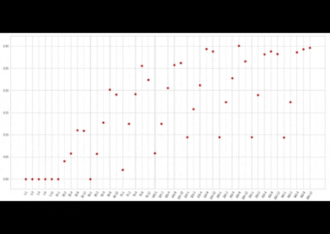

# Challenge | Cancellation Predictor

## Introduction

Sometimes, hotel bookings need to be cancelled by the guests. With the help of fast connections and flexible policies, the rate of cancellation can get pretty high, and that might create false expectations in the hotel income, and rooms that could actually be used by clients being rendered 'full' until the last second. I want to change that.

## The steps

- Download and explore actual data from a hotel system.
- Research other relevant features.
- Scrub, format, merge and select data.
- Train selected models.
- Use models for predictions, and find scores.

## Hardships along the way

- Imported environmental data had many missing values.
- Score returned over learning  is rather stochastic, so selection relied on looking a scatterplot.
- There are many other features one could use, but that will take time to implement.
- Prediction was not satisfactory for implementation of the model.

## Deliverables

- Answer if one could predict cancellations with given data.
- A csv with the filtered dataset.

## Resources

[Hotelflow - Reservations data](https://www.hotelflow.com.br)

[SEIA - Pluviometry](http://monitoramento.seia.ba.gov.br/paginas/hidrometeorologico/pluviometrico/export.xhtml)

[INMET - Meteorology](http://www.inmet.gov.br/portal/)